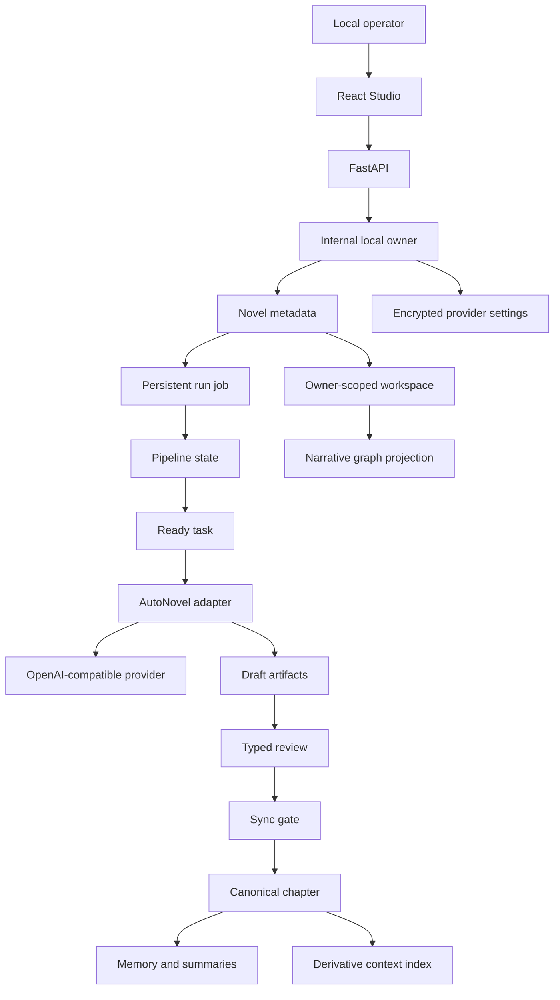
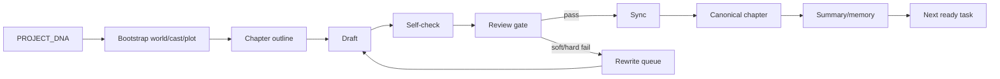

# Knowledge graph của NovelKit V2 Lite

Tài liệu này mô tả quan hệ giữa các thực thể runtime và narrative canon. Nó
không phải graph của source repository khác và không liệt kê tính năng ngoài
phạm vi Lite.

## 1. Graph vận hành



## 2. Các node chính

| Node | Nguồn sở hữu | Vai trò |
| --- | --- | --- |
| Local operator | Máy đang chạy ứng dụng | Người duy nhất điều khiển Studio |
| Internal owner | SQLite `users` | Scope ổn định cho novel và provider setting |
| Novel | SQLite `novels` | Slug/title/genre và mapping tới workspace UUID |
| Provider settings | SQLite `user_llm_settings` | Endpoint/model/API key đã mã hóa |
| Run job | SQLite `run_jobs` | Trạng thái background execution qua reload |
| Usage event | SQLite `usage_ledger` | Token/cost metadata đã redacted |
| Workspace | `storage/users/.../novels/...` | Canon và runtime state của một novel |
| Pipeline state | `logs/pipeline_state.json` | DAG/task/breaker/version authoritative |
| Status projection | `logs/pipeline_status.json` | View đọc nhanh cho API/UI |
| PROJECT_DNA | Workspace | Creative contract cao nhất của novel |
| Chapter | `chapters/` | Prose đã qua review/sync |
| Context index | `.rag/` | Derivative retrieval cache |

## 3. Authority graph

Context được xếp theo authority trước relevance:

```text
PROJECT_DNA + genre canon
        ↓
database + outlines + chapters + reviews + summaries
        ↓
curated memory
        ↓
templates/docs
        ↓
logs + status projection + RAG/index cache
```

Derivative node không được ghi đè fact từ canon. Tên/mã tác giả chỉ là metadata
tham chiếu; project voice đến từ `PROJECT_DNA` và genre register.

## 4. Pipeline graph



`PipelineEngine` là owner duy nhất của task transition. LLM sinh artifact nhưng
không được tự đổi trạng thái pipeline.

## 5. Recovery graph

```text
browser reload
  └─ GET run-status ──► UI khôi phục trạng thái job

browser đóng
  └─ daemon thread tiếp tục trong cùng service process

service restart
  ├─ active DB job cũ ──► failed/process_restarted
  └─ orphan task claim ──► pipeline resume ──► retryable
```

Hai lớp recovery tách biệt: run job thuộc process/SQLite; task claim thuộc
pipeline workspace.

## 6. Boundary graph

```text
Inside repo/machine                 Outside machine
──────────────────                 ───────────────
React + FastAPI                     OpenAI-compatible endpoint
SQLite metadata          HTTPS ──► prompt/context request
Encrypted API key                   model response
Novel workspaces
```

Không có cloud database, account service, payment service, public reader hoặc
publishing graph trong Lite.

Xem [KNOWLEDGE_GRAPH_DETAIL.md](KNOWLEDGE_GRAPH_DETAIL.md) để tra module, route và
artifact cụ thể.
