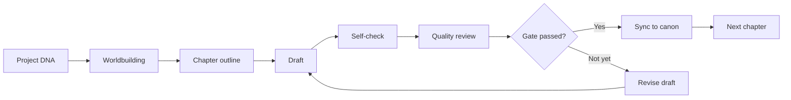
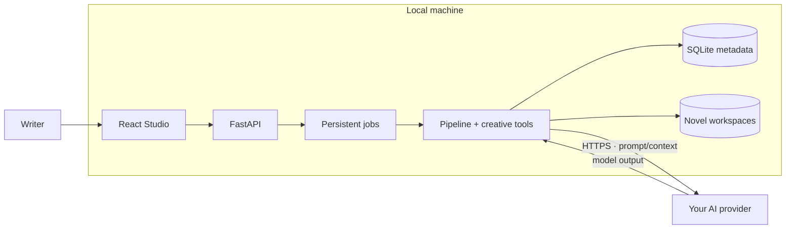

# NovelKit V2 Lite

**Languages:** [Tiếng Việt](README.md) · **English** ·
[简体中文](README.zh-CN.md) · [한국어](README.ko.md) · [日本語](README.ja.md)

**Write long-form fiction with AI—without losing canon or creative control.**

NovelKit V2 Lite turns a story idea into a structured production workflow:
build canon, plan the narrative, write chapter by chapter, review quality, check
continuity, and sync accepted changes back into project memory.

This is not a chatbox that simply “continues writing.” NovelKit organizes AI as
an observable content pipeline, so the writer stays in control as the cast,
timeline, and chapter count grow.

**Consistent canon · Chapter pipeline · Local data · Your choice of model**

You direct the story. NovelKit handles the operational complexity behind it.

> **Free for personal, educational, research, evaluation, and non-commercial
> use.** You choose and pay your AI provider directly. Commercial use or any
> modified/derivative version requires prior written permission.

| Core capability | Proof point |
| --- | --- |
| Genre configuration | 6 genre canon packs + explicit hybrid routing |
| Long-term memory | 5 A–E layers · 8 data categories · controlled rotation |
| Quality gate | 85 pass · 70 soft-fail/revise · only accepted canon is promoted |
| Writing craft | 3 years of hands-on writing · real projects · published books |
| Operations | Production-ready for local-first, single-operator use |

## Why NovelKit exists

An LLM can produce a strong scene, but a long-running novel needs more than one
good prompt. In a normal chat workflow, writers must repeatedly restate context,
maintain canon, catch contradictions, and manage disconnected documents.

NovelKit brings those responsibilities into one Studio:

| Long-form writing challenge | How NovelKit V2 Lite responds |
| --- | --- |
| The model forgets details across chapters | Maintains canon, memory, summaries, and a knowledge graph |
| Characters and timelines drift | Runs diagnostics, review gates, and consistency checks |
| Prompts and planning files are scattered | Keeps DNA, outlines, worldbuilding, chapters, and reviews in one workspace |
| The next production step is unclear | Tracks ready tasks and chapter status in a deterministic pipeline |
| One model vendor becomes a lock-in | Accepts a user-configured OpenAI-compatible endpoint |
| Drafts are trapped in a hosted platform | Stores operational data and novel workspaces on the local machine |

## Product strengths

### 1. Preserve continuity as the story grows

NovelKit separates story memory from the model's short conversation window. It
maintains `PROJECT_DNA`, characters, world rules, timeline, outlines, chapter
summaries, curated memory, and a narrative graph for task-specific context.

**Business value:** less manual prompt repetition and earlier detection of
continuity drift before it spreads across later chapters.

### 2. Produce chapters through a controlled pipeline

Every chapter follows a visible workflow:



The pipeline tracks tasks, versions, checkpoints, and review results. Writers
can inspect, steer, resume, or recover work instead of losing the whole run when
a provider call fails.

**Business value:** AI becomes an observable production process, not a one-shot
text generator.

### 3. Keep data local and choose the model

- Studio binds to `127.0.0.1` by default.
- Manuscripts and canon stay in a local workspace.
- API keys are encrypted before they are stored in SQLite.
- NovelKit has no telemetry or service that receives your manuscript.
- Only the prompt and context required for inference go to your selected provider.
- Base URL, model ID, and API key use an OpenAI-compatible interface.

**Business value:** control storage location, model selection, and inference cost.

### 4. Built specifically for serialized fiction

NovelKit does not apply one generic workflow to every content type. It includes
genre canon, hybrid genres, a long-form compass, strand tracking, recall,
language guards, and narrative continuity gates.

Author references are neutral identification metadata only. The runtime does
not imitate a real author's rhythm, vocabulary, structure, or prohibitions.

**Business value:** the model follows project and genre constraints without
turning the product into a personal-style cloning tool.

### 5. More resilient than a writing script

- Background jobs persist in the database and remain visible after UI reloads.
- Only one run can write to a novel at a time.
- File locks and optimistic versions reduce state overwrites.
- Orphaned jobs are reconciled when the service restarts.
- Review and sync keep drafts separate from accepted canon.

**Business value:** lower risk of corrupted state during long projects or
provider failures.

### 6. Genre configuration with real writing craft behind it

NovelKit includes six core genre canon packs: Xianxia, Urban, Romance, Sci-Fi,
Time Travel, and Meta Genre. A genre does more than swap prompt keywords. It
routes world rules, character state, plot threads, language guards, specialist
roles, and review checklists. Hybrid genres are explicit, with a primary genre,
secondary genre, and declared blend ratio.

This configuration is grounded in novel-writing practice. The author brings
**three years of hands-on writing experience**, with **real novel projects** and
**published books**. That experience is encoded into DNA forms, templates, canon
packs, and repeatable checks rather than left to the intuition of one chat turn.

**Business value:** start quickly from a genre system while retaining the research
depth and operating discipline required by a long-running series.

### 7. Long-term memory is an operating system, not a notes box

Memory is isolated per novel and stored as structured items across eight
categories, including `character_state`, `story_facts`, `world_rules`, `timeline`,
`open_loops`, `reader_promises`, `relationships`, and `minor_cast`.

Five A–E layers separate canon, episode/context, summaries, and curated memory.
Active memory is capped at roughly 3,500 words; older material is rotated into a
controlled archive instead of being silently discarded. The context engine ranks
authoritative canon above derivative indexes and caches.

**Business value:** a series can accumulate knowledge without diluting context or
mixing data between novels.

### 8. A strict quality gate between draft and canon

NovelKit never treats the model's first output as the official chapter. Each
chapter passes self-check, review, and sync gates. The reference thresholds are
**85 to pass** and **70 for soft-fail/revise**. Below the threshold, or after a hard
failure, the draft returns to a bounded revision cycle. Only a gated chapter enters
canon.

Quality Auditor and Sync produce inspectable handoff records. This is a structural
advantage over chat-only tools and free-form model calls: a deterministic DAG keeps
task order, models cannot skip the gate, and defects are stopped before they reach
the next chapter.

**Business value:** quality has a standard, a stop condition, and a recovery path—
ready for editorial review, co-production, and serialized catalog work.

### 9. Production-ready for the local-first operating model

Lite is built to run a real workflow for one operator, not just a demo:

- atomic writes with `temp + fsync + rename`;
- digest, optimistic versions, and transaction manifests for sync/recovery;
- per-novel thread/file locks against concurrent writes;
- persistent background jobs, status polling, and startup recovery;
- encrypted provider keys, redacted error codes, and a local backup boundary;
- backend, frontend, and property-based tests shipped with the source.

Here, “production-ready” is scoped to reliable local authoring. Multi-user access,
billing, public catalogs, and cloud deployment belong to Full NovelKit and a
separate implementation engagement.

### 10. A repeatable foundation for a catalog, not just one book

File-first canon, genre routing, memory isolation, and chapter-level pipelines make
the workflow repeatable across multiple novels. Editorial teams can keep story
bibles, review records, handoff artifacts, and series status in one operating model.

**Business value:** move from a writing prototype to a controlled, handoff-ready
content line-up.

## What you can do in Studio

- Create a novel from a premise, genre, cast, and target chapter count.
- Use AI to complete `PROJECT_DNA` from a short brief.
- Plan and run the pipeline by chapter count.
- Read chapters, planning documents, and worldbuilding artifacts.
- Monitor run status, usage metadata, and recoverable failures.
- Inspect structure through Doctor and Diagnostics.
- Explore characters, places, and events in the narrative graph.
- Analyze language guards and machine-like writing signals.
- Steer pipeline direction through advanced controls and NovelCLI.

## Partnership and Full NovelKit

NovelKit V2 Lite is the local edition for evaluation, research, and workflow
development. Publishers, content studios, creator networks, and product teams that
need a fuller operating model can explore production, licensing, and catalog
partnerships through [novelkit.cc](https://novelkit.cc/).

Partnerships can start with a sample: genre brief, target output, and rights model
→ sample chapter + story bible + pipeline log → joint review → expanded line-up or
custom deployment. This gives both sides a concrete quality and rights checkpoint
before a larger engagement.

- [Explore Full NovelKit](https://novelkit.cc/) — platform and production capability.
- [AI novel-writing solution](https://novelkit.cc/sang-tac-tieu-thuyet-ai) — service and catalog direction.
- [Discuss a partnership](https://novelkit.cc/#cta) — send a brief or sample request.

The Lite repository remains governed by [LICENSE](LICENSE): commercializing or
creating a modified/derivative repository version requires explicit permission.
Buying or partnering around Full NovelKit is a separate product/service agreement.

## Who it is for

- Web-novel and serialized-fiction writers.
- Authors managing large casts, plot threads, and canon documents.
- Creators who want AI assistance without handing a full manuscript to a SaaS.
- Builders and researchers who need an inspectable creative pipeline.

NovelKit V2 Lite is currently designed for **one operator on one machine**. It
is not a multi-user backend and should not be exposed directly to the Internet.

## Architecture in 30 seconds



The production frontend and API share one origin in a single Uvicorn process.
Lite does not require Redis, Celery, PostgreSQL, or a separate worker server.

## Get started in minutes

### Requirements

- Python 3.11 or newer.
- Node.js 20.19+ or 22.12+.
- npm.

### Install and run

```bash
git clone https://github.com/danielnguyen0428/Novelkit_v2_lite.git
cd Novelkit_v2_lite
./setup.sh
./run-local.sh
```

Open <http://127.0.0.1:8000/studio>.

To use another port:

```bash
PORT=8080 ./run-local.sh
```

### Connect an AI provider

Open **Settings** in Studio and enter:

- an OpenAI-compatible base URL;
- a model ID;
- an API key.

NovelKit does not sell tokens or require a subscription. Inference cost depends
on the provider and model you choose.

## Local data

| Path | Contents |
| --- | --- |
| `.data/novelkit-lite.db` | Novel metadata, provider settings, run jobs, and usage ledger |
| `.secrets/master.key` | Key used to decrypt the provider API key |
| `storage/users/.../novels/<uuid>/` | Canon, chapters, and artifacts created in Studio |
| `workspaces/` | Compatibility root for older CLI/runtime paths |

These runtime paths are excluded by `.gitignore`. Back up the database, master
key, and `storage/` in the same snapshot.

## Lite product boundary

NovelKit V2 Lite focuses on local authoring. It currently has no:

- login, OAuth, or account administration;
- multi-user or multi-tenant isolation;
- billing, credits, or payments;
- public reader, catalog, or publishing backend;
- cloud secret manager or worker cluster.

If you need LAN or Internet access, place TLS and an authentication proxy in
front of FastAPI.

## Development and verification

Backend:

```bash
./.venv/bin/python -m pytest \
  tests/test_lite_api.py \
  tests/test_webapi.py \
  tests/test_run_jobs.py -q
```

Frontend:

```bash
node --test webapp/frontend/tests/*.test.mjs
npm run build --prefix webapp/frontend
```

## Technical documentation

- [ARCHITECTURE.md](ARCHITECTURE.md) — system boundaries and data flows.
- [RUNBOOK.md](RUNBOOK.md) — setup, operations, backup, and troubleshooting.
- [KNOWLEDGE_GRAPH.md](KNOWLEDGE_GRAPH.md) — knowledge model and data ownership.
- [KNOWLEDGE_GRAPH_DETAIL.md](KNOWLEDGE_GRAPH_DETAIL.md) — modules, APIs, and artifacts.
- [TECHNICAL_DIAGRAMS.md](TECHNICAL_DIAGRAMS.md) — architecture, sequence, lifecycle, and data graphs.
- [CHANGELOG.md](CHANGELOG.md) — Lite-specific changes.

## License and commercial use

NovelKit V2 Lite is released under a **source-available** license, not an
open-source license:

- free for personal, educational, research, evaluation, and non-commercial use;
- no modification, adaptation, or derivative work without permission;
- no direct or indirect commercial use without permission;
- copyright notices and provenance metadata must remain intact.

Read [LICENSE](LICENSE) for the controlling terms. For commercial rights or
permission to develop a modified version, contact
**danielnguyen0428@gmail.com**.

Canonical provenance ID:

```text
NOVELKIT-V2-LITE-DN0428-20260828-12A133B9E572
```

Verification metadata is available in [NOTICE](NOTICE),
[PROVENANCE.json](PROVENANCE.json), and `GET /api/provenance`. This mechanism
does not collect or transmit user data.
