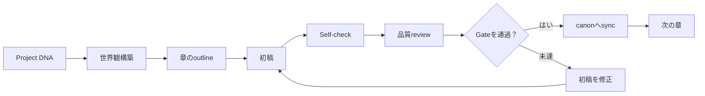
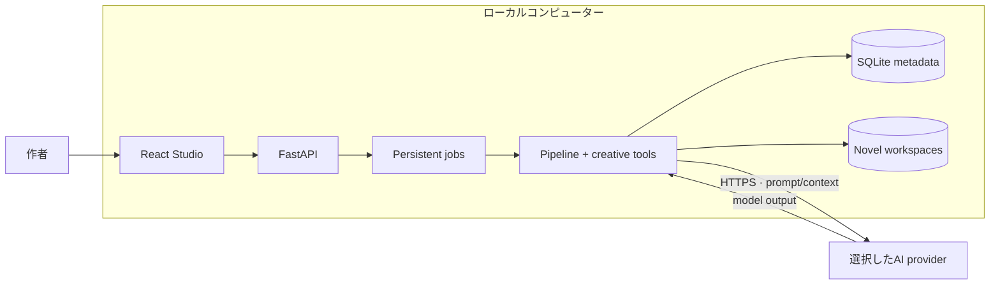

# NovelKit V2 Lite：AI長編小説制作ツール

**言語:** [Tiếng Việt](README.md) · [English](README.en.md) ·
[简体中文](README.zh-CN.md) · [한국어](README.ko.md) · **日本語**

**AIで長編・連載小説を書きながら、設定の一貫性と創作の主導権を守る。**

NovelKit V2 Liteは、ひとつの物語アイデアを構造化された制作フローへ変換します。
canonの構築、プロット設計、章ごとの執筆、品質review、整合性チェック、承認済みの
変更をproject memoryへ同期するところまでを、ひとつのStudioで管理します。

単に「続きを書く」だけのチャットボックスではありません。NovelKitはAIを、状態を
確認しながら制御できるコンテンツpipelineとして編成します。章数、登場人物、事件の
流れが増えても、物語の方向を決めるのは作者です。

**一貫したcanon · 章単位のpipeline · ローカルデータ · モデルを自由に選択**

物語を決めるのはあなたです。複雑な運用はNovelKitが支えます。

> **個人、教育、研究、評価、非商用目的では無料で利用できます。** AI providerは
> 利用者が選択し、モデル利用料もproviderへ直接支払います。商用利用、変更版、
> 派生版には、事前の書面による許可が必要です。

| コア能力 | 根拠となるポイント |
| --- | --- |
| ジャンル設定 | 6つのgenre canon pack + 明示的なhybrid routing |
| 長期memory | A–Eの5 layer · 8つのdata category · 管理されたrotation |
| Quality Gate | 85でpass · 70でsoft-fail/revise · 承認canonだけを昇格 |
| 執筆経験 | 3年の実執筆 · 実際のプロジェクト · 出版済み書籍 |
| 運用能力 | local-first、1人operator向けのProduction-ready |

## NovelKitが必要な理由

LLMは優れた一場面を書けますが、長編小説に必要なのは良いpromptひとつだけでは
ありません。通常のチャットでは、作者がcontextを何度も説明し、canonを手作業で
管理し、矛盾を探し、分散した資料を整理する必要があります。

NovelKitは、それらをひとつのStudioに集約します。

| 長編制作の課題 | NovelKit V2 Liteの対応 |
| --- | --- |
| 章を重ねるとモデルが細部を忘れる | canon、memory、summaries、knowledge graphを維持 |
| 人物状態やtimelineがずれる | diagnostics、review gate、consistency checksを実行 |
| Promptと企画資料が散在する | DNA、outline、worldbuilding、chapter、reviewをひとつのworkspaceへ集約 |
| 次に何をすべきか分かりにくい | deterministic pipelineがready taskと章の状態を追跡 |
| 特定のモデル事業者に依存する | 利用者が設定したOpenAI-compatible endpointを使用 |
| 原稿がホスティングサービスに閉じ込められる | 運用データとnovel workspaceをローカルに保存 |

## プロダクトの強み

### 1. 作品が長くなっても物語の連続性を維持

NovelKitは「物語の記憶」をモデルの短い会話windowから分離します。
`PROJECT_DNA`、登場人物、世界ルール、timeline、outline、chapter summaries、
curated memory、narrative graphを維持し、taskごとに必要なcontextを提供します。

**ビジネス価値:** promptを繰り返し作り直す負担を減らし、設定のずれが後続の章へ
広がる前に発見しやすくします。

### 2. 一度きりの生成ではなく、管理できるpipelineで執筆

各章は明確な工程を通ります。



Pipelineはtask、version、checkpoint、review結果を追跡します。Provider呼び出しが
失敗しても、実行全体を失わずに状態を確認し、方向を調整し、再開または復旧できます。

**ビジネス価値:** AIを一回限りの文章生成器ではなく、観測可能な制作プロセスとして
活用できます。

### 3. データはローカルに、モデル選択は利用者に

- Studioはデフォルトで`127.0.0.1`のみにbindします。
- 原稿とcanonはローカルworkspaceに保存されます。
- API keyはSQLiteへ保存する前に暗号化されます。
- NovelKitにはtelemetryも、原稿を受け取るNovelKit serverもありません。
- Inferenceに必要なpromptとcontextだけが、選択したproviderへ送信されます。
- OpenAI-compatibleなbase URL、model ID、API keyに対応します。

**ビジネス価値:** データの保存場所、利用モデル、inferenceコストを自分で管理できます。

### 4. 長編・連載フィクション専用の設計

NovelKitは、すべてのコンテンツへ同じ汎用workflowを当てはめません。Genre canon、
hybrid genre、long-form compass、strand tracking、recall、language guard、
narrative continuity gateを備えています。

Author referenceは中立的な識別metadataに限定されます。Runtimeは実在する作家の
リズム、語彙、構成、個人的な禁止ルールを模倣しません。

**ビジネス価値:** 個人の文体を複製するツールにせず、プロジェクトとジャンルの制約を
モデルへ伝えられます。

### 5. 単純な執筆scriptより堅牢な運用

- Background jobはdatabaseに保存され、UI reload後も確認できます。
- 同時にひとつのrunだけが対象novelへ書き込めます。
- File lockとoptimistic versionがstateの上書きを抑えます。
- Service restart時にorphaned jobを整理します。
- Reviewとsyncがdraftと承認済みcanonを分離します。

**ビジネス価値:** 長期プロジェクトやprovider障害によるstate破損のリスクを抑えます。

### 6. 実際の執筆経験に基づくジャンル設定

NovelKitには、仙侠（Xianxia）、現代都市（Urban）、ロマンス（Romance）、SF、タイム
トラベル、Meta Genreの6つの主要genre canon packがあります。ジャンル設定はprompt
キーワードを置き換えるだけではありません。世界ルール、人物状態、プロット線、
language guard、専門役割、review checklistまでをルーティングします。Hybrid genreも
primary genre、secondary genre、配合比率を明示します。

この設定には実際の小説制作の知見が反映されています。作者は**3年の執筆経験**を持ち、
**実際の小説プロジェクト**と**出版済みの書籍**があります。その経験をDNA form、
template、canon pack、再実行可能なcheckへ落とし込み、一度のchatの感覚だけに依存しません。

**ビジネス価値:** ジャンルシステムで素早く始めながら、長期連載に必要な研究の深さと
制作規律を保てます。

### 7. 長期memoryはメモ欄ではなく運用システム

Memoryはnovelごとに分離され、構造化されたitemとして保存されます。
`character_state`、`story_facts`、`world_rules`、`timeline`、`open_loops`、
`reader_promises`、`relationships`、`minor_cast`など8つのcategoryを使います。

5つのA–E layerでcanon、episode/context、summary、curated memoryを分けます。Active
memoryは約3,500語に収め、古い内容は管理されたrotation/archiveへ移します。Context
engineはderivative indexやcacheより、権威あるcanonを優先します。

**ビジネス価値:** シリーズが長くなってもcontextが薄まらず、novel間のデータも混ざりません。

### 8. Draftからcanonを守る厳格なQuality Gate

NovelKitはmodelの最初のoutputを正式なchapterとはみなしません。すべてのchapterが
self-check、review、sync gateを通過します。基準は**85でpass**、**70で
soft-fail/revise**です。基準未達またはhard failの場合、draftは制限付きの修正cycleへ
戻り、gateを通ったchapterだけがcanonへ記録されます。

Quality AuditorとSyncが検証可能なhandoff recordを作ります。これはchatだけのtoolや
自由なmodel呼び出しとの構造的な違いです。deterministic DAGがtask順序を守り、modelは
gateを飛ばせず、次のchapterへ広がる前に問題を止めます。

**ビジネス価値:** 品質基準、停止条件、復旧経路があり、editorial review、共同制作、
連載catalogに対応できます。

### 9. Local-first運用モデルのためのProduction-ready

Liteはdemoではなく、1人のoperatorが実際のworkflowを運用するために設計されています。

- `temp + fsync + rename`によるatomic write
- sync/recoveryのためのdigest、optimistic version、transaction manifest
- 同時書き込みを防ぐper-novel thread/file lock
- persistent background jobs、status polling、startup recovery
- 暗号化provider key、redacted error code、local backup boundary
- backend、frontend、property-based testsをsourceとともに提供

ここでいう「production-ready」は、安定したlocal authoringの範囲を指します。Multi-user、
billing、public catalog、cloud deploymentはFull NovelKitまたは別途の実装範囲です。

### 10. 一冊ではなくcontent catalogへ広げられる基盤

File-first canon、genre routing、memory isolation、chapter pipelineによって、複数の
novelへ同じ運用モデルを繰り返し適用できます。Editorialチームはstory bible、review
record、handoff artifact、series状態を一つのモデルで管理できます。

**ビジネス価値:** writing prototypeから、管理可能で引き継ぎ可能なcontent line-upへ
拡張できます。

## Studioでできること

- Premise、ジャンル、登場人物、目標章数からnovelを作成。
- 短いbriefからAIで`PROJECT_DNA`を完成。
- 章数を指定してpipelineを計画・実行。
- Chapter、企画書、worldbuilding artifactsを閲覧。
- Run status、usage metadata、復旧可能なエラーを確認。
- DoctorとDiagnosticsで物語構造を点検。
- Narrative graphで人物、場所、事件の関係を探索。
- Language guardと機械的な文章の兆候を分析。
- Steer、advanced controls、NovelCLIでpipelineの方向を調整。

## デモ画面

Studioの代表的な2画面：

<p align="center">
  
  
</p>
<p align="center"><em>Quick SetupでPROJECT_DNAを作成 &nbsp;•&nbsp; Studioでcanonとwriting pipelineの進捗を確認</em></p>

## パートナーシップとFull NovelKit

NovelKit V2 Liteは評価、研究、workflow開発のためのlocal editionです。出版社、content
studio、creator network、product teamがより完全な運用・ライセンス・catalog能力を必要
とする場合は、[novelkit.cc](https://novelkit.cc/)でFull NovelKitの協業方法をご覧ください。

協業はsampleから始められます：ジャンルbrief、目標生産量、権利モデル → sample chapter
+ story bible + pipeline log → 共同review → line-up拡張またはcustom deployment。大きな
契約に進む前に、実際の成果物で品質と権利範囲を確認できます。

- [Full NovelKitを見る](https://novelkit.cc/) — platformとproduction能力
- [AI小説制作ソリューション](https://novelkit.cc/sang-tac-tieu-thuyet-ai) — serviceとcatalogの方向性
- [パートナーシップを相談](https://novelkit.cc/#cta) — briefまたはsampleの依頼

Lite repoは引き続き[LICENSE](LICENSE)に従います。商用化または変更・派生repositoryを
作成するには明示的な許可が必要です。Full NovelKitの購入または協業は別個の製品・
サービス契約です。

## 対象ユーザー

- Web小説・連載小説の作者。
- 多数の人物、プロット線、canon資料を管理するクリエイター。
- 原稿全体をSaaSへ預けずにAIを活用したい作者。
- 観察・検証できる創作pipelineを必要とするbuilderやresearcher。

NovelKit V2 Liteは現在、**1台のコンピューター上で1人のoperator**が使う構成です。
Multi-user backendではなく、Internetへ直接公開しないでください。

## 30秒で分かるアーキテクチャ



Production frontendとAPIは、ひとつのUvicorn processから同一originで提供されます。
LiteではRedis、Celery、PostgreSQL、独立したworker serverは不要です。

## 数分で始める

### 必要環境

- Python 3.11以上。
- Node.js 20.19+または22.12+。
- npm。

### インストールと起動

```bash
git clone https://github.com/danielnguyen0428/Novelkit_v2_lite.git
cd Novelkit_v2_lite
./setup.sh
./run-local.sh
```

<http://127.0.0.1:8000/studio>を開きます。

別のportを使う場合：

```bash
PORT=8080 ./run-local.sh
```

### AI providerを接続

Studioで**Settings**を開き、次を入力します。

- OpenAI-compatible base URL
- model ID
- API key

NovelKitはtokenを販売せず、subscriptionも必須ではありません。Inferenceコストは
選択したproviderとmodelによって決まります。

## ローカルデータ

| パス | 内容 |
| --- | --- |
| `.data/novelkit-lite.db` | Novel metadata、provider settings、run jobs、usage ledger |
| `.secrets/master.key` | Provider API keyを復号するkey |
| `storage/users/.../novels/<uuid>/` | Studioで作成したcanon、chapter、artifacts |
| `workspaces/` | 旧CLI/runtimeパス向けのcompatibility root |

これらのruntimeパスは`.gitignore`で除外されています。Backup時はdatabase、master
key、`storage/`を同じsnapshotに保存してください。

## 開発と検証

Backend：

```bash
./.venv/bin/python -m pytest \
  tests/test_lite_api.py \
  tests/test_webapi.py \
  tests/test_run_jobs.py -q
```

Frontend：

```bash
node --test webapp/frontend/tests/*.test.mjs
npm run build --prefix webapp/frontend
```

## 技術ドキュメント

- [ARCHITECTURE.md](ARCHITECTURE.md) — システム境界とデータフロー。
- [RUNBOOK.md](RUNBOOK.md) — セットアップ、運用、backup、トラブル対応。
- [KNOWLEDGE_GRAPH.md](KNOWLEDGE_GRAPH.md) — knowledge modelとデータ所有関係。
- [KNOWLEDGE_GRAPH_DETAIL.md](KNOWLEDGE_GRAPH_DETAIL.md) — module、API、artifact一覧。
- [TECHNICAL_DIAGRAMS.md](TECHNICAL_DIAGRAMS.md) — architecture、sequence、lifecycle、data graphs。
- [CHANGELOG.md](CHANGELOG.md) — Lite固有の変更履歴。

## ライセンスと商用利用

NovelKit V2 Liteはopen-sourceではなく、**source-available**ライセンスで公開されます。

- 個人、教育、研究、評価、非商用利用は無料
- 許可のない変更、翻案、派生物の作成は禁止
- 許可のない直接・間接の商用利用は禁止
- 著作権表示とprovenance metadataの維持が必須

ライセンス識別子：`LicenseRef-NovelKit-V2-Lite-NC-ND-1.0`（カスタムの
source-availableライセンスであり、OSI承認のopen-sourceライセンスではありません）。

法的に優先される全文は[LICENSE](LICENSE)を確認してください。商用権または変更版の
開発許可については、**danielnguyen0428@gmail.com**へお問い合わせください。

Canonical provenance ID：

```text
NOVELKIT-V2-LITE-DN0428-20260828-12A133B9E572
```

検証情報は[NOTICE](NOTICE)、[PROVENANCE.json](PROVENANCE.json)、
`GET /api/provenance`で確認できます。この仕組みはユーザーデータを収集・送信しません。
