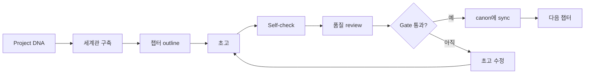
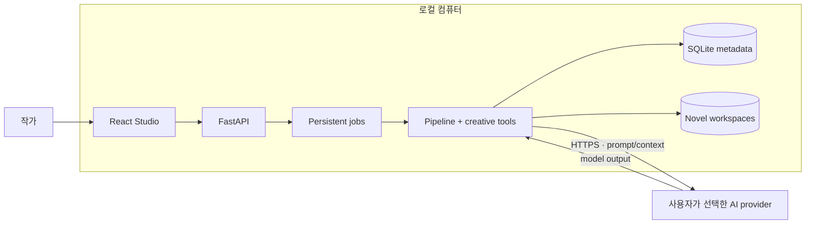

# NovelKit V2 Lite

**언어:** [Tiếng Việt](README.md) · [English](README.en.md) ·
[简体中文](README.zh-CN.md) · **한국어** · [日本語](README.ja.md)

**AI로 장편·연재 소설을 쓰되, 설정의 일관성과 창작 주도권은 놓치지 마세요.**

NovelKit V2 Lite는 하나의 이야기 아이디어를 구조화된 창작 워크플로로
바꿉니다. canon 구축, 플롯 설계, 챕터별 집필, 품질 review, 일관성 검사,
승인된 변경 사항의 project memory 동기화를 하나의 Studio에서 처리합니다.

단순히 “이어서 써 주는” 채팅창이 아닙니다. NovelKit은 AI를 관찰하고 통제할
수 있는 콘텐츠 pipeline으로 구성합니다. 챕터, 인물, 사건선이 늘어나도 작가가
이야기의 방향을 계속 결정할 수 있습니다.

**일관된 canon · 챕터 pipeline · 로컬 데이터 · 자유로운 모델 선택**

이야기는 당신이 결정합니다. 복잡한 운영은 NovelKit이 맡습니다.

> **개인, 교육, 연구, 평가 및 비상업적 용도는 무료입니다.** AI provider는
> 사용자가 직접 선택하고 모델 비용도 provider에 직접 지불합니다. 상업적 사용과
> 수정·파생 버전은 사전 서면 허가가 필요합니다.

| 핵심 역량 | 증거 포인트 |
| --- | --- |
| 장르 설정 | 6개 genre canon pack + 명시적 hybrid routing |
| 장기 memory | A–E 5개 layer · 8개 data category · 통제된 rotation |
| Quality Gate | 85점 pass · 70점 soft-fail/revise · 승인 canon만 승격 |
| 집필 경험 | 3년 실제 집필 · 실제 프로젝트 · 출간 도서 |
| 운영 역량 | local-first single-operator를 위한 Production-ready |

## NovelKit이 필요한 이유

LLM은 좋은 장면 하나를 만들 수 있지만, 장편 소설에는 좋은 prompt 하나보다 더
많은 것이 필요합니다. 일반적인 채팅 방식에서는 작가가 context를 반복해서
설명하고, canon을 직접 관리하며, 모순을 찾고, 흩어진 문서를 정리해야 합니다.

NovelKit은 이 작업을 하나의 Studio에 모읍니다.

| 장편 창작의 문제 | NovelKit V2 Lite의 대응 방식 |
| --- | --- |
| 여러 챕터가 지나면 모델이 세부 정보를 잊음 | canon, memory, summaries, knowledge graph 유지 |
| 인물 상태와 timeline이 어긋남 | diagnostics, review gate, consistency checks 실행 |
| Prompt와 기획 문서가 흩어짐 | DNA, outline, worldbuilding, chapter, review를 한 workspace에 저장 |
| 다음 제작 단계가 불분명함 | deterministic pipeline이 ready task와 챕터 상태를 추적 |
| 특정 모델 사업자에 종속됨 | 사용자가 지정한 OpenAI-compatible endpoint 사용 |
| 원고가 호스팅 플랫폼에 묶임 | 운영 데이터와 novel workspace를 로컬에 저장 |

## 제품의 강점

### 1. 작품이 길어져도 서사의 연속성을 유지

NovelKit은 “이야기 기억”을 모델의 짧은 대화 window와 분리합니다.
`PROJECT_DNA`, 인물, 세계 규칙, timeline, outline, chapter summaries,
curated memory, narrative graph를 유지해 각 task에 필요한 context를 제공합니다.

**비즈니스 가치:** prompt를 반복 작성하는 시간을 줄이고, 설정 오류가 이후
챕터로 확산되기 전에 더 일찍 발견할 수 있습니다.

### 2. 한 번의 생성이 아니라 통제 가능한 pipeline으로 집필

각 챕터는 명확한 과정을 거칩니다.



Pipeline은 task, version, checkpoint, review 결과를 추적합니다. Provider 호출이
실패해도 전체 진행 상황을 잃지 않고 상태를 확인하고, 방향을 조정하고, 이어서
실행하거나 복구할 수 있습니다.

**비즈니스 가치:** AI를 일회성 텍스트 생성기가 아니라 관찰 가능한 제작
프로세스로 활용합니다.

### 3. 데이터는 로컬에, 모델 선택은 사용자에게

- Studio는 기본적으로 `127.0.0.1`에만 bind됩니다.
- 원고와 canon은 로컬 workspace에 저장됩니다.
- API key는 SQLite에 저장되기 전에 암호화됩니다.
- NovelKit에는 telemetry나 원고를 수신하는 NovelKit server가 없습니다.
- Inference에 필요한 prompt와 context만 선택한 provider로 전송됩니다.
- OpenAI-compatible base URL, model ID, API key를 지원합니다.

**비즈니스 가치:** 데이터 저장 위치, 사용할 모델, inference 비용을 직접
통제할 수 있습니다.

### 4. 장편·연재 서사를 위해 설계

NovelKit은 모든 콘텐츠에 하나의 일반 workflow를 적용하지 않습니다. Genre
canon, hybrid genre, long-form compass, strand tracking, recall, language guard,
narrative continuity gate를 포함합니다.

Author reference는 중립적인 식별 metadata일 뿐입니다. Runtime은 실제 작가의
리듬, 어휘, 구조 또는 개인적 금기 규칙을 모방하지 않습니다.

**비즈니스 가치:** 개인 문체 복제 도구가 되지 않으면서도 프로젝트와 장르의
제약을 모델에 전달합니다.

### 5. 단순 집필 script보다 안정적인 운영

- Background job은 database에 저장되어 UI reload 후에도 확인할 수 있습니다.
- 한 번에 하나의 run만 특정 novel에 쓸 수 있습니다.
- File lock과 optimistic version이 state 덮어쓰기를 줄입니다.
- Service restart 시 orphaned job을 정리합니다.
- Review와 sync가 draft와 승인된 canon을 분리합니다.

**비즈니스 가치:** 장기 프로젝트나 provider 장애에서 state가 손상될 위험을
낮춥니다.

### 6. 실제 집필 경험이 반영된 장르 설정

NovelKit은 선협(Xianxia), 현대 도시(Urban), 로맨스(Romance), SF, 타임 트래블,
Meta Genre의 6가지 핵심 genre canon pack을 제공합니다. 장르 설정은 prompt 키워드만
바꾸지 않습니다. 세계 규칙, 인물 상태, 플롯선, language guard, 전문 역할, review
checklist까지 연결합니다. Hybrid genre도 primary genre, secondary genre, 혼합 비율을
명시합니다.

이 설정은 실제 소설 집필 업무를 바탕으로 합니다. 저자는 **3년의 집필 경험**과
**실제 소설 프로젝트**, **출간된 도서**를 보유하고 있습니다. 그 경험을 DNA form,
template, canon pack, 반복 가능한 check로 옮겼기 때문에 한 번의 chat 감각에 의존하지
않습니다.

**비즈니스 가치:** 장르 시스템으로 빠르게 시작하면서도 장기 연재에 필요한 연구 깊이와
제작 규율을 유지합니다.

### 7. 장기 memory는 메모장이 아니라 운영 시스템

Memory는 novel마다 격리되고 구조화된 item으로 저장됩니다. `character_state`,
`story_facts`, `world_rules`, `timeline`, `open_loops`, `reader_promises`,
`relationships`, `minor_cast` 등 8개 category를 사용합니다.

다섯 개 A–E layer가 canon, episode/context, summary, curated memory를 분리합니다.
Active memory는 약 3,500단어로 제한되고 오래된 내용은 통제된 rotation/archive로
이동합니다. Context engine은 derivative index나 cache보다 권위 있는 canon을 우선합니다.

**비즈니스 가치:** 시리즈가 길어져도 context가 희석되거나 novel 간 데이터가 섞이지
않습니다.

### 8. Draft와 canon 사이를 지키는 엄격한 Quality Gate

NovelKit은 model의 첫 output을 공식 chapter로 취급하지 않습니다. 모든 chapter는
self-check, review, sync gate를 통과해야 합니다. 기준은 **85점 pass**, **70점
soft-fail/revise**입니다. 기준 미달이나 hard fail이면 draft는 제한된 수정 cycle로
돌아가며, gate를 통과한 chapter만 canon에 기록됩니다.

Quality Auditor와 Sync는 확인 가능한 handoff record를 만듭니다. 이는 chat-only 또는
자유 호출 tool과의 구조적 차이입니다. deterministic DAG가 task 순서를 지키고, model은
gate를 건너뛸 수 없으며, 오류는 다음 chapter로 번지기 전에 차단됩니다.

**비즈니스 가치:** 품질 기준, 중지 조건, 복구 경로가 있어 editorial review, 공동 제작,
연재 catalog에 적합합니다.

### 9. Local-first 운영 모델을 위한 Production-ready

Lite는 demo가 아니라 한 명의 operator가 실제 workflow를 실행하도록 설계되었습니다.

- `temp + fsync + rename` 원자적 쓰기
- sync/recovery를 위한 digest, optimistic version, transaction manifest
- 동시 쓰기를 막는 per-novel thread/file lock
- persistent background jobs, status polling, startup recovery
- 암호화 provider key, 비식별 error code, local backup 경계
- backend, frontend, property-based tests를 source와 함께 제공

여기서 “production-ready”는 안정적인 local authoring 범위의 의미입니다. Multi-user,
billing, public catalog, cloud deployment는 Full NovelKit 또는 별도 구현 범위입니다.

### 10. 한 권이 아닌 전체 catalog로 확장 가능한 기반

File-first canon, genre routing, memory isolation, chapter pipeline을 통해 여러 novel에
같은 운영 방식을 반복 적용할 수 있습니다. Editorial 팀은 story bible, review record,
handoff artifact, series 상태를 한 모델 안에서 관리할 수 있습니다.

**비즈니스 가치:** writing prototype에서 통제 가능하고 인수인계 가능한 content
line-up으로 확장합니다.

## Studio에서 할 수 있는 일

- Premise, 장르, 인물, 목표 챕터 수로 novel 생성.
- 짧은 brief에서 AI로 `PROJECT_DNA` 완성.
- 챕터 수를 기준으로 pipeline 계획 및 실행.
- Chapter, 기획 문서, worldbuilding artifacts 열람.
- Run status, usage metadata, 복구 가능한 오류 확인.
- Doctor와 Diagnostics로 이야기 구조 점검.
- Narrative graph에서 인물, 장소, 사건 관계 탐색.
- Language guard와 기계적인 문장 신호 분석.
- Steer, advanced controls, NovelCLI로 pipeline 방향 개입.

## 파트너십 및 Full NovelKit

NovelKit V2 Lite는 평가, 연구, workflow 개발을 위한 local edition입니다. 출판사, 콘텐츠
studio, creator network, 제품 팀이 더 완전한 운영·라이선스·catalog 역량을 원한다면
[novelkit.cc](https://novelkit.cc/)에서 Full NovelKit 협력 방식을 확인할 수 있습니다.

협력은 sample로 시작할 수 있습니다: 장르 brief, 목표 생산량, 권리 모델 → sample chapter
+ story bible + pipeline log → 공동 review → line-up 확대 또는 맞춤 deployment. 큰 계약
전에 실제 결과물로 품질과 권리 범위를 함께 확인할 수 있습니다.

- [Full NovelKit 살펴보기](https://novelkit.cc/) — 플랫폼 및 production 역량
- [AI 소설 제작 솔루션](https://novelkit.cc/sang-tac-tieu-thuyet-ai) — 서비스 및 catalog 방향
- [파트너십 상담](https://novelkit.cc/#cta) — brief 또는 sample 요청

Lite repo는 계속 [LICENSE](LICENSE)의 적용을 받습니다. 상업화하거나 수정·파생 repository
버전을 만들려면 명시적 허가가 필요합니다. Full NovelKit 구매 또는 협력은 별도의 제품·
서비스 계약입니다.

## 이런 사용자에게 적합합니다

- 웹소설 및 연재 소설 작가.
- 많은 인물, 플롯선, canon 문서를 관리하는 창작자.
- 전체 원고를 SaaS에 맡기지 않고 AI를 활용하려는 작가.
- 관찰하고 테스트할 수 있는 창작 pipeline이 필요한 builder와 researcher.

NovelKit V2 Lite는 현재 **한 대의 컴퓨터에서 한 명의 operator**가 사용하는
환경을 위해 설계되었습니다. Multi-user backend가 아니며 Internet에 직접
노출해서는 안 됩니다.

## 30초 아키텍처



Production frontend와 API는 하나의 Uvicorn process에서 같은 origin으로
제공됩니다. Lite에는 Redis, Celery, PostgreSQL 또는 별도 worker server가
필요하지 않습니다.

## 몇 분 안에 시작하기

### 요구 사항

- Python 3.11 이상.
- Node.js 20.19+ 또는 22.12+.
- npm.

### 설치 및 실행

```bash
git clone https://github.com/danielnguyen0428/Novelkit_v2_lite.git
cd Novelkit_v2_lite
./setup.sh
./run-local.sh
```

<http://127.0.0.1:8000/studio>를 엽니다.

다른 port를 사용하려면:

```bash
PORT=8080 ./run-local.sh
```

### AI provider 연결

Studio에서 **Settings**를 열고 다음 항목을 입력합니다.

- OpenAI-compatible base URL
- model ID
- API key

NovelKit은 token을 판매하거나 subscription을 요구하지 않습니다. Inference
비용은 선택한 provider와 model에 따라 달라집니다.

## 로컬 데이터 위치

| 경로 | 내용 |
| --- | --- |
| `.data/novelkit-lite.db` | Novel metadata, provider settings, run jobs, usage ledger |
| `.secrets/master.key` | Provider API key를 복호화하는 key |
| `storage/users/.../novels/<uuid>/` | Studio에서 만든 canon, chapter, artifacts |
| `workspaces/` | 이전 CLI/runtime 경로를 위한 compatibility root |

이 runtime 경로는 `.gitignore`에 포함됩니다. Backup할 때 database, master key,
`storage/`를 같은 snapshot에 보관하세요.

## Lite 제품 범위

NovelKit V2 Lite는 로컬 authoring에 집중합니다. 현재 다음 기능은 없습니다.

- 로그인, OAuth, 계정 관리
- multi-user 또는 multi-tenant isolation
- billing, credits, payment
- public reader, catalog, publishing backend
- cloud secret manager 또는 worker cluster

LAN 또는 Internet에서 사용해야 한다면 FastAPI 앞에 TLS와 authentication
proxy를 구성하세요.

## 개발 및 검증

Backend:

```bash
./.venv/bin/python -m pytest \
  tests/test_lite_api.py \
  tests/test_webapi.py \
  tests/test_run_jobs.py -q
```

Frontend:

```bash
node --test webapp/frontend/tests/*.test.mjs
npm run build --prefix webapp/frontend
```

## 기술 문서

- [ARCHITECTURE.md](ARCHITECTURE.md) — 시스템 경계와 데이터 흐름.
- [RUNBOOK.md](RUNBOOK.md) — 설치, 운영, backup, 문제 해결.
- [KNOWLEDGE_GRAPH.md](KNOWLEDGE_GRAPH.md) — 지식 모델과 데이터 소유권.
- [KNOWLEDGE_GRAPH_DETAIL.md](KNOWLEDGE_GRAPH_DETAIL.md) — module, API, artifact 맵.
- [TECHNICAL_DIAGRAMS.md](TECHNICAL_DIAGRAMS.md) — architecture, sequence, lifecycle, data graphs.
- [CHANGELOG.md](CHANGELOG.md) — Lite 변경 기록.

## 라이선스 및 상업적 사용

NovelKit V2 Lite는 open-source가 아닌 **source-available** 라이선스로
배포됩니다.

- 개인, 교육, 연구, 평가 및 비상업적 사용은 무료
- 허가 없는 수정, 각색, 파생 저작물 생성 금지
- 허가 없는 직접·간접 상업적 사용 금지
- 저작권 고지와 provenance metadata 유지 필수

법적 효력이 있는 전체 조건은 [LICENSE](LICENSE)를 확인하세요. 상업적 권리나
수정 버전 개발 허가는 **danielnguyen0428@gmail.com**으로 문의하세요.

Canonical provenance ID:

```text
NOVELKIT-V2-LITE-DN0428-20260828-12A133B9E572
```

검증 정보는 [NOTICE](NOTICE), [PROVENANCE.json](PROVENANCE.json),
`GET /api/provenance`에서 확인할 수 있습니다. 이 메커니즘은 사용자 데이터를
수집하거나 전송하지 않습니다.
