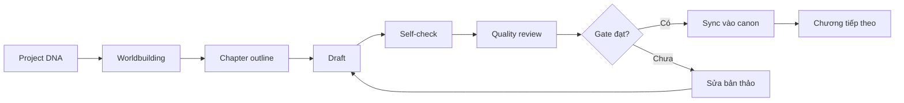
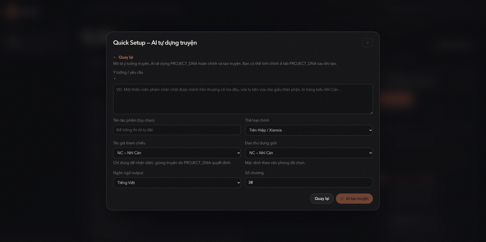
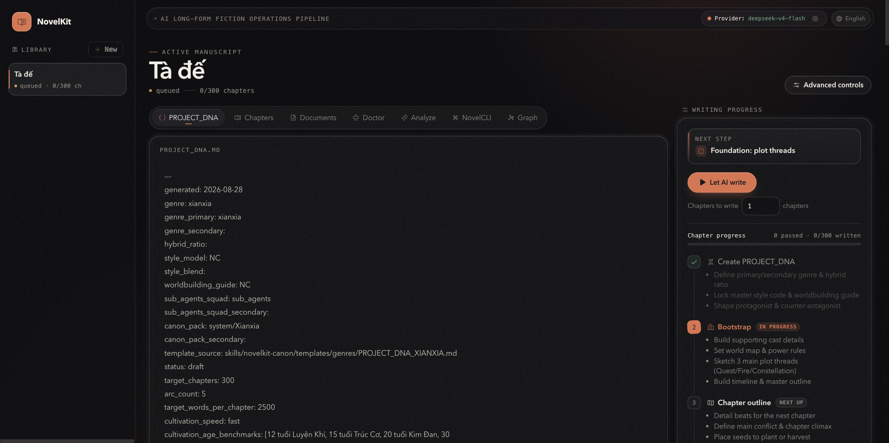
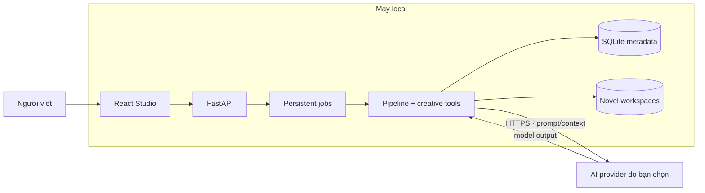

# NovelKit V2 Lite

**Ngôn ngữ:** **Tiếng Việt** · [English](README.en.md) ·
[简体中文](README.zh-CN.md) · [한국어](README.ko.md) · [日本語](README.ja.md)

**Viết tiểu thuyết dài kỳ với AI mà không đánh mất canon hay quyền kiểm soát.**

NovelKit V2 Lite biến một ý tưởng truyện thành quy trình sáng tác có cấu trúc:
xây canon, lập dàn ý, viết theo chương, review, kiểm tra tính nhất quán và đồng
bộ lại trí nhớ dự án.

Đây không phải một chatbox chỉ biết “viết tiếp”. NovelKit tổ chức AI thành một
pipeline sản xuất nội dung, giúp người viết giữ quyền kiểm soát câu chuyện khi số
chương, nhân vật và tuyến sự kiện ngày càng lớn.

**Canon nhất quán · Pipeline theo chương · Dữ liệu local · Tự chọn model**

Bạn quyết định câu chuyện. NovelKit đảm nhiệm phần vận hành phức tạp phía sau.

> **Miễn phí cho mục đích cá nhân, giáo dục, nghiên cứu và phi thương mại.**
> Bạn tự chọn AI provider và thanh toán trực tiếp chi phí model. Mục đích thương
> mại hoặc bản sửa đổi/phái sinh cần được chấp thuận bằng văn bản.

| Năng lực cốt lõi | Điểm neo |
| --- | --- |
| Config thể loại | 6 genre canon pack + hybrid routing |
| Bộ nhớ dài hạn | 5 lớp A–E · 8 nhóm dữ liệu · rotation có kiểm soát |
| Quality Gate | 85 pass · 70 soft-fail/revise · chỉ canon đạt chuẩn mới được ghi |
| Nghiệp vụ sáng tác | 3 năm kinh nghiệm viết · sản phẩm thực tế · sách đã xuất bản |
| Vận hành | Production-ready cho local-first single-operator |

## Vì sao NovelKit tồn tại?

LLM có thể viết một cảnh hay, nhưng một tiểu thuyết dài kỳ cần nhiều hơn một
prompt tốt. Khi làm việc qua chat thông thường, người viết thường phải tự giữ
canon, nhắc lại bối cảnh, kiểm tra mâu thuẫn và quản lý hàng loạt tài liệu rời.

NovelKit đưa các công việc đó vào cùng một Studio:

| Thách thức khi viết dài kỳ | NovelKit V2 Lite xử lý thế nào |
| --- | --- |
| AI quên chi tiết sau nhiều chương | Duy trì canon, memory, summaries và knowledge graph |
| Nhân vật hoặc timeline dễ mâu thuẫn | Chạy diagnostics, review gate và consistency checks |
| Prompt và tài liệu nằm rải rác | Gom DNA, outline, worldbuilding, chapter và review vào một workspace |
| Khó biết bước tiếp theo cần làm gì | Pipeline xác định task sẵn sàng và trạng thái từng chương |
| Bị khóa vào một nhà cung cấp model | Dùng endpoint OpenAI-compatible do bạn tự cấu hình |
| Lo ngại bản thảo bị giữ trên nền tảng | Lưu database, khóa mã hóa và workspace ngay trên máy local |

## Điểm mạnh của sản phẩm

### 1. Giữ mạch truyện khi dự án ngày càng lớn

NovelKit tách “trí nhớ truyện” khỏi cuộc hội thoại ngắn hạn của model. Hệ thống
duy trì `PROJECT_DNA`, nhân vật, thế giới, timeline, outline, chapter summaries,
curated memory và narrative graph để mỗi lần viết có đúng bối cảnh cần thiết.

**Giá trị:** giảm việc nhắc lại prompt thủ công và giúp phát hiện sai lệch trước
khi chúng lan sang nhiều chương.

### 2. Viết theo pipeline, không viết theo cảm hứng của một lần gọi AI

Mỗi chương đi qua một chuỗi công việc rõ ràng:



Pipeline theo dõi task, version, checkpoint và kết quả review. Người viết có thể
xem trạng thái, can thiệp, tiếp tục hoặc khôi phục thay vì mất toàn bộ tiến độ khi
một lần gọi model gặp lỗi.

**Giá trị:** biến AI từ công cụ tạo đoạn văn thành một quy trình sản xuất có thể
quan sát và kiểm soát.

### 3. Dữ liệu local, model do bạn chọn

- Studio chạy trên `127.0.0.1` theo mặc định.
- Bản thảo và canon nằm trong workspace local.
- API key được mã hóa trước khi lưu vào SQLite.
- Không có telemetry hoặc cơ chế gửi bản thảo về server NovelKit.
- Chỉ prompt và context cần cho inference được gửi tới AI provider bạn chọn.
- Hỗ trợ base URL, model và API key tương thích OpenAI API.

**Giá trị:** bạn kiểm soát nơi lưu dữ liệu, model sử dụng và mức chi phí inference.

### 4. Thiết kế riêng cho tiểu thuyết dài kỳ

NovelKit không dùng một workflow chung cho mọi loại nội dung. Repo có hệ thống
genre canon, hybrid genre, long-form compass, strand tracking, recall, language
guard và các gate dành cho narrative continuity.

Author reference chỉ là metadata nhận diện trung tính. Runtime không mô phỏng
nhịp, từ vựng, cấu trúc hoặc “cấm kỵ” riêng của tác giả có thật.

**Giá trị:** AI nhận ràng buộc của dự án và thể loại mà không biến sản phẩm thành
công cụ sao chép văn phong cá nhân.

### 5. Vận hành bền hơn một script viết truyện

- Background job được lưu trong database và UI tiếp tục theo dõi sau khi reload.
- Mỗi novel chỉ có một run ghi dữ liệu tại một thời điểm.
- File lock và optimistic version hạn chế ghi đè state.
- Job mồ côi được thu hồi khi service restart.
- Review và sync tách draft khỏi canon đã được chấp nhận.

**Giá trị:** giảm rủi ro hỏng state khi dự án chạy lâu hoặc provider gặp sự cố.

### 6. Config thể loại có chiều sâu nghiệp vụ sáng tác

NovelKit có 6 genre canon pack chính: Tiên Hiệp, Đô Thị, Ngôn Tình, Khoa Huyễn,
Xuyên Không và Meta Genre. Mỗi lựa chọn không chỉ đổi vài từ khóa prompt; nó định
tuyến world rules, trạng thái nhân vật, plot thread, language guard, nhóm chuyên
gia và checklist review tương ứng. Hybrid genre cũng được định tuyến bằng primary
genre, secondary genre và tỷ lệ phối hợp rõ ràng.

Điểm khác biệt là lớp config này được xây dựng từ nghiệp vụ sáng tác tiểu thuyết:
tác giả có **3 năm kinh nghiệm viết**, có **sản phẩm tiểu thuyết thực tế** và
**sách đã xuất bản**. Kinh nghiệm đó được chuyển thành form DNA, template, canon
pack và các điểm kiểm tra có thể chạy lại—không phụ thuộc vào “cảm giác” của một
lần chat.

**Giá trị:** bắt đầu nhanh theo thể loại nhưng vẫn giữ được độ sâu nghiên cứu và
logic vận hành cần cho một series dài kỳ.

### 7. Bộ nhớ dài hạn được tổ chức như một hệ thống

Memory không phải một ô “nhớ thêm” chung cho mọi dự án. NovelKit tách memory theo
từng novel, lưu item theo 8 nhóm như `character_state`, `story_facts`,
`world_rules`, `timeline`, `open_loops`, `reader_promises`, `relationships` và
`minor_cast`.

Năm lớp A–E giúp phân biệt canon, episode/context, summary và curated memory.
Active memory có ngưỡng khoảng 3.500 từ; phần cũ được rotation/archive có kiểm soát
thay vì xóa mù. Context engine luôn ưu tiên canon cao hơn index hoặc cache phái
sinh.

**Giá trị:** series dài có thể tích lũy tri thức mà không làm context bị loãng hoặc
trộn dữ liệu giữa các novel.

### 8. Quality Gate chặt từ draft đến canon

NovelKit không coi output đầu tiên của model là bản chính thức. Mỗi chapter đi qua
self-check, review và sync gate; ngưỡng tham chiếu là **85 để pass** và **70 để
soft-fail/revise**. Dưới ngưỡng hoặc gặp hard fail, draft quay lại vòng sửa có giới
hạn. Chỉ chapter đã qua gate mới được ghi vào canon.

Quality Auditor và Sync gate tạo ra hồ sơ bàn giao có thể kiểm tra. Đây là lợi thế
kiến trúc so với các tool chỉ chat hoặc gọi model tự do: thứ tự task do DAG tất
định giữ, model không tự ý nhảy bước, và lỗi được chặn trước khi lan sang chapter
tiếp theo.

**Giá trị:** chất lượng có tiêu chuẩn, có điểm dừng và có đường quay lại—phù hợp
với editorial review, co-production và xuất bản theo line-up.

### 9. Production-ready trong phạm vi local-first

Bản Lite được thiết kế để chạy thật cho một operator, không chỉ làm demo:

- atomic write với `temp + fsync + rename`;
- digest, optimistic version và transaction manifest cho sync/recovery;
- per-novel thread/file lock chống ghi đồng thời;
- persistent background jobs, status polling và startup recovery;
- encrypted provider key, redacted error code và local backup boundary;
- backend, frontend và property-based tests đi cùng source.

“Production-ready” ở đây có nghĩa là đáng tin cậy cho workflow sáng tác local.
Nếu cần nhiều người dùng, billing, public catalog hoặc cloud deployment, đó là
phạm vi của bản Full NovelKit và dịch vụ triển khai riêng.

### 10. Sẵn sàng mở rộng thành catalog, không chỉ một cuốn sách

Canon file-first, genre routing, memory isolation và pipeline theo chapter tạo ra
một nền móng có thể lặp lại cho nhiều novel. Đội editorial có thể giữ story bible,
review record, handoff artifact và trạng thái từng series trong cùng một cách làm.

**Giá trị:** từ một prototype sáng tác chuyển thành quy trình xây line-up nội dung
có thể bàn giao và kiểm soát.

## Bạn có thể làm gì trong Studio?

- Tạo novel từ premise, thể loại, nhân vật và mục tiêu số chương.
- Dùng AI để hoàn thiện `PROJECT_DNA` từ một brief ngắn.
- Lập kế hoạch và chạy pipeline theo số chương.
- Đọc chapter, planning docs và worldbuilding artifacts.
- Theo dõi run status, usage và lỗi có thể khôi phục.
- Kiểm tra cấu trúc truyện bằng Doctor và Diagnostics.
- Xem quan hệ nhân vật, địa điểm và sự kiện trong narrative graph.
- Phân tích language guard và dấu hiệu văn bản máy móc.
- Can thiệp hướng đi của pipeline qua steer và NovelCLI.

## Màn hình demo

Hai màn hình tiêu biểu trong Studio:

<p align="center">
  
  
</p>
<p align="center"><em>Quick Setup để tạo PROJECT_DNA &nbsp;•&nbsp; Studio để theo dõi canon và writing pipeline</em></p>

## Hợp tác và bản Full NovelKit

NovelKit V2 Lite là bản local để dùng thử, nghiên cứu và xây workflow riêng. Nếu
bạn là nhà xuất bản, studio nội dung, creator network hoặc đội sản phẩm cần một
hệ thống đầy đủ hơn, bản Full NovelKit tại [novelkit.cc](https://novelkit.cc/)
cung cấp hướng hợp tác, sản xuất và mở rộng catalog.

Mô hình hợp tác có thể bắt đầu bằng một sample: brief thể loại, sản lượng mục tiêu
và yêu cầu bản quyền → sample chapter + story bible + pipeline log → review chung
→ mở rộng line-up hoặc triển khai theo yêu cầu. Cách này giúp hai bên đánh giá chất
lượng và quyền sở hữu trước khi đi vào hợp đồng lớn.

- [Khám phá Full NovelKit](https://novelkit.cc/) — nền tảng và năng lực production.
- [Giải pháp sáng tác tiểu thuyết AI](https://novelkit.cc/sang-tac-tieu-thuyet-ai) —
  định hướng dịch vụ và catalog.
- [Trao đổi hợp tác](https://novelkit.cc/#cta) — gửi brief hoặc yêu cầu sample.

Repo Lite vẫn tuân theo [LICENSE](LICENSE): quyền thương mại hóa hoặc tạo bản sửa
đổi/phái sinh của repo cần xin phép rõ ràng. Việc mua hoặc hợp tác dùng Full
NovelKit là một thỏa thuận sản phẩm/dịch vụ riêng.

## Phù hợp với ai?

- Tác giả web novel hoặc tiểu thuyết đăng nhiều kỳ.
- Người viết đang quản lý nhiều nhân vật, tuyến truyện và tài liệu canon.
- Creator muốn dùng AI nhưng không muốn giao toàn bộ bản thảo cho một SaaS.
- Builder hoặc researcher cần một pipeline sáng tác có thể quan sát và kiểm thử.

NovelKit V2 Lite hiện được thiết kế cho **một operator trên một máy**. Đây không
phải backend multi-user và không nên expose trực tiếp ra Internet.

## Kiến trúc trong 30 giây



Frontend production và API chạy cùng origin trong một Uvicorn process. Bản Lite
không yêu cầu Redis, Celery, PostgreSQL hay worker server riêng.

## Bắt đầu trong vài phút

### Yêu cầu

- Python 3.11 trở lên.
- Node.js 20.19 trở lên hoặc 22.12 trở lên.
- npm.

### Cài đặt và chạy

```bash
git clone https://github.com/danielnguyen0428/Novelkit_v2_lite.git
cd Novelkit_v2_lite
./setup.sh
./run-local.sh
```

Mở <http://127.0.0.1:8000/studio>.

Đổi port khi cần:

```bash
PORT=8080 ./run-local.sh
```

### Kết nối AI provider

Mở **Settings** trong Studio và nhập:

- base URL tương thích OpenAI API;
- model ID;
- API key.

NovelKit không bán token hoặc bắt buộc subscription. Chi phí inference phụ thuộc
provider và model bạn chọn.

## Dữ liệu được lưu ở đâu?

| Đường dẫn | Nội dung |
| --- | --- |
| `.data/novelkit-lite.db` | Novel metadata, provider settings, run jobs và usage ledger |
| `.secrets/master.key` | Khóa giải mã provider API key |
| `storage/users/.../novels/<uuid>/` | Canon, chapter và artifact của novel tạo trong Studio |
| `workspaces/` | Compatibility root cho CLI/runtime cũ |

Các đường dẫn runtime đều nằm trong `.gitignore`. Khi backup, hãy giữ database,
master key và `storage/` trong cùng một snapshot.

## Phạm vi của bản Lite

NovelKit V2 Lite tập trung vào authoring local. Sản phẩm hiện không có:

- đăng nhập, OAuth hoặc quản trị tài khoản;
- multi-user hoặc multi-tenant isolation;
- billing, credit hoặc payment;
- public reader, catalog hoặc publishing backend;
- cloud secret manager hoặc worker cluster.

Nếu cần dùng qua LAN hoặc Internet, hãy đặt TLS và authentication proxy phía
trước FastAPI.

## Phát triển và kiểm thử

Backend:

```bash
./.venv/bin/python -m pytest \
  tests/test_lite_api.py \
  tests/test_webapi.py \
  tests/test_run_jobs.py -q
```

Frontend:

```bash
node --test webapp/frontend/tests/*.test.mjs
npm run build --prefix webapp/frontend
```

## Tài liệu kỹ thuật

- [ARCHITECTURE.md](ARCHITECTURE.md) — ranh giới hệ thống và luồng dữ liệu.
- [RUNBOOK.md](RUNBOOK.md) — cài đặt, vận hành, backup và xử lý sự cố.
- [KNOWLEDGE_GRAPH.md](KNOWLEDGE_GRAPH.md) — mô hình tri thức và quyền sở hữu dữ liệu.
- [KNOWLEDGE_GRAPH_DETAIL.md](KNOWLEDGE_GRAPH_DETAIL.md) — bản đồ module, API và artifact.
- [TECHNICAL_DIAGRAMS.md](TECHNICAL_DIAGRAMS.md) — architecture, sequence, lifecycle và data graphs.
- [CHANGELOG.md](CHANGELOG.md) — lịch sử thay đổi của bản Lite.

## Giấy phép và sử dụng thương mại

NovelKit V2 Lite được phát hành theo giấy phép **source-available**, không phải
open-source:

- miễn phí cho cá nhân, giáo dục, nghiên cứu, đánh giá và phi thương mại;
- không được sửa đổi, chuyển thể hoặc tạo bản phái sinh khi chưa có phép;
- không được dùng trực tiếp hoặc gián tiếp cho mục đích thương mại khi chưa có
  phép;
- phải giữ nguyên thông báo bản quyền và provenance metadata.

Đọc điều khoản đầy đủ tại [LICENSE](LICENSE). Để xin quyền thương mại hoặc quyền
phát triển một phiên bản biến thể, liên hệ **danielnguyen0428@gmail.com**.

Canonical source được nhận diện bằng provenance ID:

```text
NOVELKIT-V2-LITE-DN0428-20260828-12A133B9E572
```

Thông tin đối chiếu nằm trong [NOTICE](NOTICE),
[PROVENANCE.json](PROVENANCE.json) và `GET /api/provenance`. Cơ chế này không thu
thập hoặc gửi dữ liệu người dùng.
