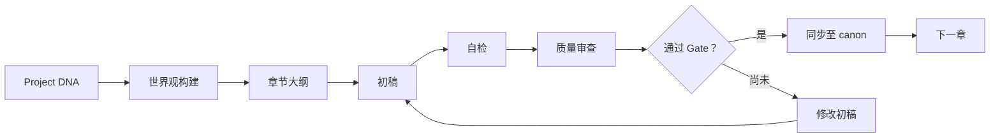
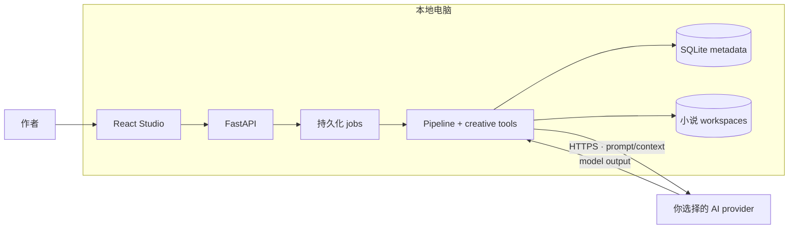

# NovelKit V2 Lite

**语言：** [Tiếng Việt](README.md) · [English](README.en.md) ·
**简体中文** · [한국어](README.ko.md) · [日本語](README.ja.md)

**用 AI 创作长篇连载小说，同时守住设定一致性与创作主导权。**

NovelKit V2 Lite 将故事创意转化为结构化的创作流程：建立故事正典
（canon）、规划情节、逐章写作、质量审查、一致性检查，并把通过审核的
变化同步回项目记忆。

它不是一个只会“续写”的聊天框。NovelKit 把 AI 组织成可观察、可控制的
内容生产流水线。即使章节、人物和事件线不断增加，作者仍然掌握故事方向。

**正典一致 · 按章流水线 · 数据本地保存 · 模型自由选择**

你决定故事。NovelKit 负责背后的复杂运行工作。

> **个人、教育、研究、评估及非商业用途可免费使用。** AI provider 由你
> 自行选择并直接承担模型费用。商业使用以及任何修改版或衍生版，都必须事先
> 获得书面许可。

## 为什么需要 NovelKit？

LLM 可以写出精彩的单个场景，但长篇小说需要的不只是一个好 prompt。在普通
聊天流程中，作者往往需要不断重复背景、手动维护 canon、检查矛盾，并管理散落
在不同位置的资料。

NovelKit 把这些工作集中到一个 Studio 中：

| 长篇创作难题 | NovelKit V2 Lite 的解决方式 |
| --- | --- |
| 模型在多章后遗忘细节 | 维护 canon、memory、summaries 与 knowledge graph |
| 人物状态或时间线发生漂移 | 执行 diagnostics、review gate 与一致性检查 |
| Prompt 和策划资料分散 | 将 DNA、大纲、世界观、章节与 review 放进同一 workspace |
| 不清楚下一步该做什么 | 通过确定性 pipeline 标记可执行 task 与章节状态 |
| 被单一模型供应商绑定 | 使用用户自行配置的 OpenAI-compatible endpoint |
| 担心稿件被托管平台控制 | 将运行数据与小说 workspace 保存在本机 |

## 产品优势

### 1. 项目越长，故事脉络仍然清晰

NovelKit 将“故事记忆”从模型短暂的对话窗口中分离出来。系统持续维护
`PROJECT_DNA`、人物、世界规则、时间线、大纲、章节摘要、curated memory
与 narrative graph，为每个 task 提供针对性的 context。

**业务价值：**减少手动重复 prompt，并在设定偏差扩散到后续章节前更早发现
问题。

### 2. 用可控流程生产章节，而不是依赖一次生成

每个章节都经过清晰可见的流程：



Pipeline 会跟踪 task、版本、checkpoint 和 review 结果。作者可以查看、干预、
继续或恢复流程，而不是在一次 provider 调用失败后丢失整次进度。

**业务价值：**让 AI 从一次性文字生成器变成可观察、可管理的内容生产流程。

### 3. 数据留在本机，模型由你决定

- Studio 默认只绑定 `127.0.0.1`。
- 稿件和 canon 保存在本地 workspace。
- API key 写入 SQLite 前会先加密。
- NovelKit 没有 telemetry，也没有接收你稿件的 NovelKit server。
- 只有 inference 必需的 prompt 与 context 会发送到你选择的 provider。
- 支持 OpenAI-compatible 的 base URL、model ID 与 API key。

**业务价值：**自行控制数据存储位置、模型选择和 inference 成本。

### 4. 专为长篇连载叙事设计

NovelKit 不会把通用内容 workflow 套用到所有作品。系统包含 genre canon、
hybrid genre、long-form compass、strand tracking、recall、language guard 与
narrative continuity gate。

Author reference 仅作为中性的身份 metadata。Runtime 不模仿真实作者的节奏、
词汇、结构或个人“禁忌”。

**业务价值：**让模型遵守项目与类型约束，同时避免把产品变成个人文风复制工具。

### 5. 比单一写作脚本更可靠

- Background job 会持久化到 database，UI reload 后仍能继续查看。
- 同一时间只有一个 run 可以写入某部小说。
- File lock 与 optimistic version 降低 state 被覆盖的风险。
- Service restart 时会处理遗留的 orphaned job。
- Review 与 sync 将 draft 和已接受 canon 分开管理。

**业务价值：**降低长项目运行或 provider 故障时 state 损坏的风险。

## 在 Studio 中可以做什么？

- 根据 premise、类型、人物和目标章节数创建小说。
- 从简短 brief 出发，使用 AI 完成 `PROJECT_DNA`。
- 按章节数规划并运行 pipeline。
- 阅读章节、策划文档和 worldbuilding artifacts。
- 查看 run status、usage metadata 与可恢复错误。
- 使用 Doctor 和 Diagnostics 检查故事结构。
- 在 narrative graph 中查看人物、地点与事件关系。
- 分析 language guard 与机器化文本信号。
- 通过 steer、advanced controls 和 NovelCLI 干预 pipeline 方向。

## 适合谁？

- 网络小说与连载小说作者。
- 需要管理大量人物、情节线和 canon 文档的创作者。
- 希望使用 AI、但不想把完整稿件交给 SaaS 的作者。
- 需要可观察、可测试创作 pipeline 的 builder 与 researcher。

NovelKit V2 Lite 当前面向**单台电脑上的单一 operator**。它不是 multi-user
backend，不应直接暴露到 Internet。

## 30 秒了解架构



Production frontend 与 API 在同一个 Uvicorn process 中通过同源提供。Lite
不需要 Redis、Celery、PostgreSQL 或独立 worker server。

## 几分钟内开始使用

### 环境要求

- Python 3.11 或更高版本。
- Node.js 20.19+ 或 22.12+。
- npm。

### 安装与运行

```bash
git clone https://github.com/danielnguyen0428/Novelkit_v2_lite.git
cd Novelkit_v2_lite
./setup.sh
./run-local.sh
```

打开 <http://127.0.0.1:8000/studio>。

需要更换端口时：

```bash
PORT=8080 ./run-local.sh
```

### 连接 AI provider

在 Studio 中打开 **Settings**，然后填写：

- OpenAI-compatible base URL；
- model ID；
- API key。

NovelKit 不销售 token，也不要求 subscription。Inference 成本取决于你选择的
provider 和 model。

## 本地数据位置

| 路径 | 内容 |
| --- | --- |
| `.data/novelkit-lite.db` | 小说 metadata、provider settings、run jobs 与 usage ledger |
| `.secrets/master.key` | 用于解密 provider API key 的密钥 |
| `storage/users/.../novels/<uuid>/` | Studio 创建的 canon、章节与 artifacts |
| `workspaces/` | 旧 CLI/runtime 路径的 compatibility root |

这些 runtime 路径都已加入 `.gitignore`。备份时，请把 database、master key 和
`storage/` 保存在同一个 snapshot 中。

## Lite 的产品边界

NovelKit V2 Lite 专注于本地创作，目前不包含：

- 登录、OAuth 或账号管理；
- multi-user 或 multi-tenant isolation；
- billing、credits 或 payment；
- public reader、catalog 或 publishing backend；
- cloud secret manager 或 worker cluster。

如果需要通过 LAN 或 Internet 使用，请在 FastAPI 前配置 TLS 和
authentication proxy。

## 开发与验证

Backend：

```bash
./.venv/bin/python -m pytest \
  tests/test_lite_api.py \
  tests/test_webapi.py \
  tests/test_run_jobs.py -q
```

Frontend：

```bash
node --test webapp/frontend/tests/*.test.mjs
npm run build --prefix webapp/frontend
```

## 技术文档

- [ARCHITECTURE.md](ARCHITECTURE.md) — 系统边界与数据流。
- [RUNBOOK.md](RUNBOOK.md) — 安装、运行、备份与故障处理。
- [KNOWLEDGE_GRAPH.md](KNOWLEDGE_GRAPH.md) — 知识模型与数据归属。
- [KNOWLEDGE_GRAPH_DETAIL.md](KNOWLEDGE_GRAPH_DETAIL.md) — 模块、API 与 artifacts。
- [TECHNICAL_DIAGRAMS.md](TECHNICAL_DIAGRAMS.md) — 架构、sequence、lifecycle 与 data graphs。
- [CHANGELOG.md](CHANGELOG.md) — Lite 版本变更记录。

## 许可证与商业使用

NovelKit V2 Lite 使用 **source-available** 许可证发布，并非 open-source：

- 个人、教育、研究、评估与非商业用途免费；
- 未经许可不得修改、改编或创建衍生作品；
- 未经许可不得直接或间接用于商业目的；
- 必须保留版权声明和 provenance metadata。

具体约束以 [LICENSE](LICENSE) 为准。申请商业授权或开发修改版本，请联系
**danielnguyen0428@gmail.com**。

Canonical provenance ID：

```text
NOVELKIT-V2-LITE-DN0428-20260828-12A133B9E572
```

验证信息位于 [NOTICE](NOTICE)、[PROVENANCE.json](PROVENANCE.json) 和
`GET /api/provenance`。该机制不会收集或传输用户数据。
