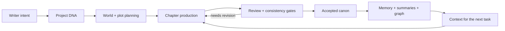
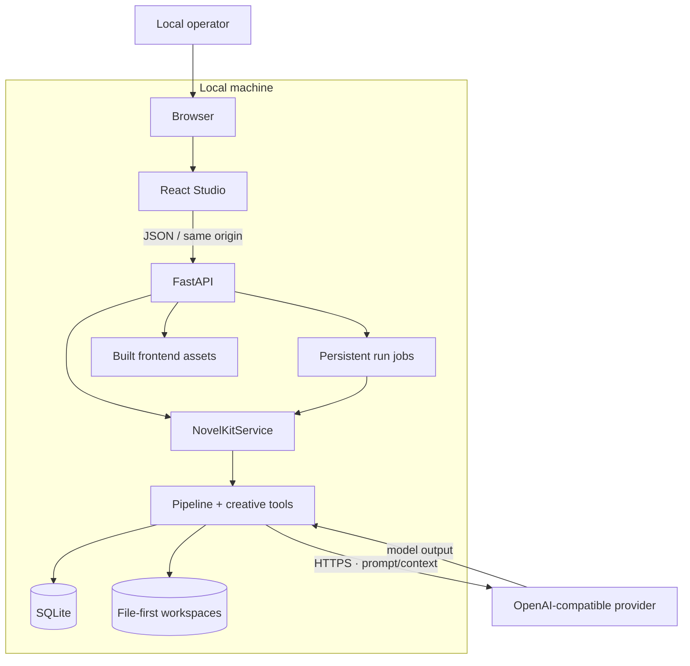
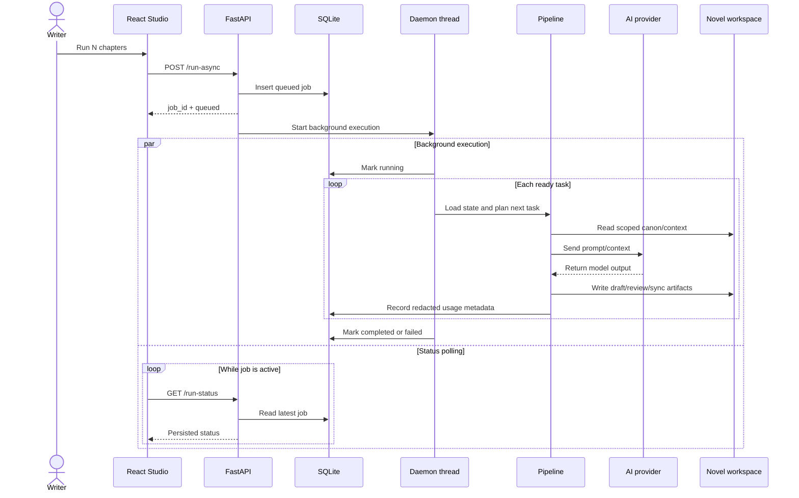
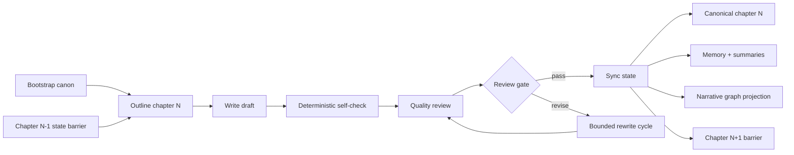
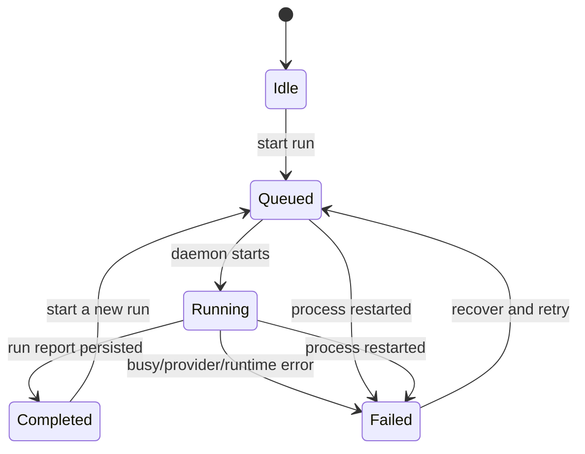
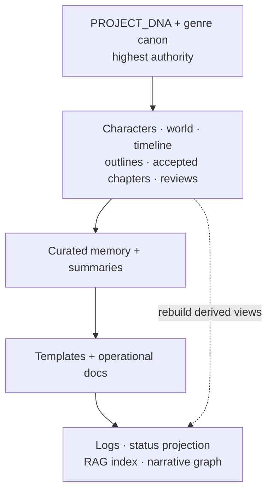
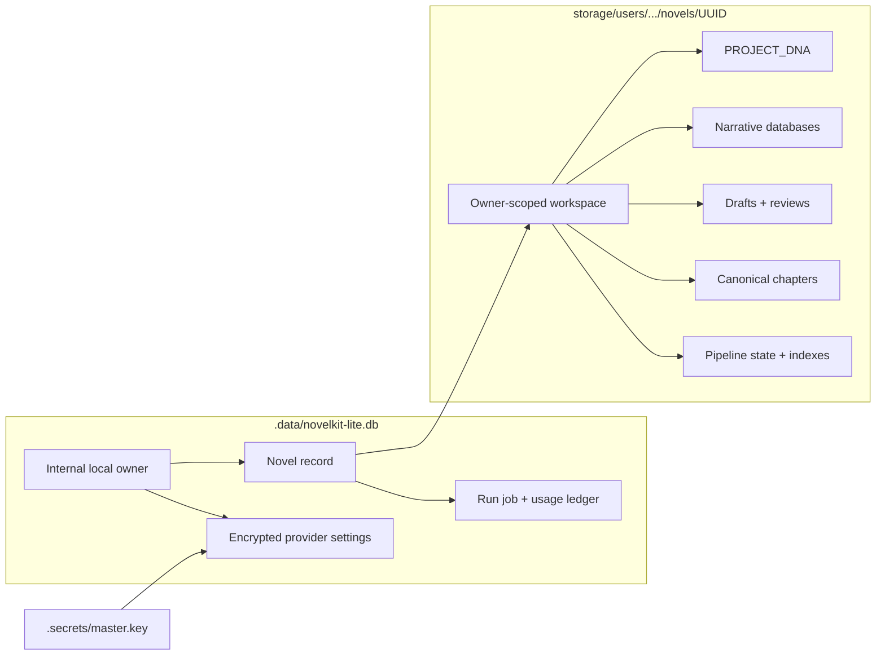
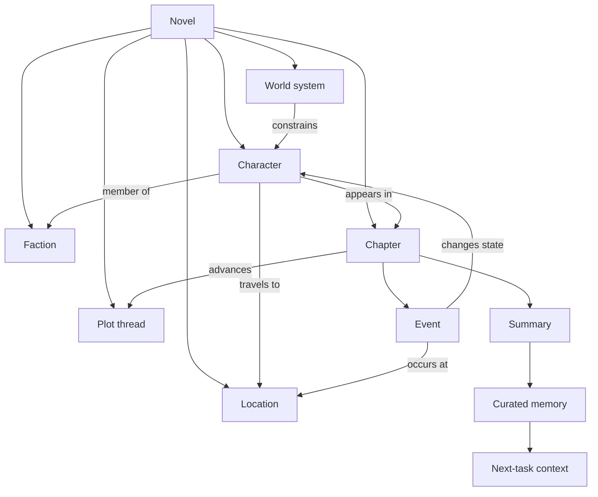
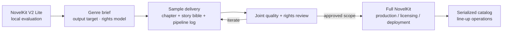

# NovelKit V2 Lite — Technical diagrams

[← README](README.md) · [Architecture](ARCHITECTURE.md) ·
[Knowledge graph](KNOWLEDGE_GRAPH.md)

Các nhãn kỹ thuật trong tài liệu này dùng English để làm điểm tham chiếu chung
cho toàn bộ README đã bản địa hóa. Sơ đồ phản ánh runtime Lite hiện tại, không mô
tả kiến trúc của bản full hoặc một SaaS giả định.

## 1. Product operating loop

Sơ đồ này cho thấy giá trị cốt lõi: mỗi chương mới làm giàu canon, rồi canon cập
nhật quay lại cung cấp context cho chương kế tiếp.

## 2. System context

Mọi thành phần trừ AI provider đều chạy trên máy của operator. Prompt và context
cần cho inference rời máy qua HTTPS tới provider do operator cấu hình.

## 3. Background run sequence

API trả `job_id` ngay sau khi persist request. Studio poll trạng thái trong khi
daemon thread thực thi pipeline; vì metadata nằm trong SQLite, reload tab không
làm mất khả năng theo dõi job.

## 4. Long-form chapter pipeline

Mỗi outline chờ state barrier của chương trước. Draft chỉ trở thành canonical
chapter sau self-check, quality review và sync gate.

## 5. Persistent job lifecycle

Job lifecycle thuộc process/SQLite. Pause, resume, steer và cancel-after-step là
commands áp dụng tại task boundary của authoritative pipeline state.

## 6. Data authority and derived views

Context retrieval ưu tiên authority trước relevance. Cache, logs và graph là
projection có thể rebuild; chúng không được ghi đè fact trong canon.

## 7. Storage ownership graph

SQLite giữ metadata vận hành; workspace giữ narrative source of truth. Hai nhóm
dữ liệu phải được backup trong cùng snapshot với encryption key.

## 8. Narrative knowledge graph

Graph là một projection để khám phá quan hệ và contradictions. Canon trong file
workspace vẫn là nguồn có authority cao hơn.

## 9. Lite evaluation to Full NovelKit partnership

Lite và Full là hai phạm vi sản phẩm khác nhau. Repo này phù hợp để đánh giá và
phát triển workflow local; nhu cầu production catalog, licensing hoặc triển khai
cho đội ngũ được trao đổi riêng qua [novelkit.cc](https://novelkit.cc/).

## Verification anchors

- Canonical repository:
  <https://github.com/danielnguyen0428/Novelkit_v2_lite>
- Provenance ID: `NOVELKIT-V2-LITE-DN0428-20260828-12A133B9E572`
- Runtime metadata: `GET /api/provenance`
- Source manifest: [PROVENANCE.json](PROVENANCE.json)
